# Community Bonding Period : 9th May to 1st June 2025

## 20th May'2025
- First Meet with Domenico + Nahuel
- Laid the foundation on how we gonna start working
    - Reciter first -> Parser in Phausto at a later stage in summer 
    - Make API for PAM -> just like this one for PAM : [LINK](https://discordier.github.io/sam/)
    - Lot's of mini test cases 
    - a pair programming sess in JUNE -> to see how Nahuel uses Pharo adequatly
    

### To Do's for me :

- SAM repo go through + specifcially the Reciter part
- connect a Github repo to iceberg -> share with Domenico + Nahuel as contributors
- start with SAM reciter translation in Pharo -> add it in the same above repo
 
## 22nd May'2025
- Started with the self study of SAM
    - 
    - 
    - 
- SAM uses 450 rules to convert English into SAM’s phonetic language
- Phoneme Rules of SAM : 
    - 

- Fetch SAM api `sam-js from npm`
    - code at [SAM API Fetch](<Code Try Ons/1_SAM_api>)
    - here's output : 
        - 
        - <audio controls src="Code Try Ons/Ouput Of Codes/sam(1).wav" title="Title"></audio>


- Insights I got to know 
    - Audio dosent start on its on browser -> we need a user interaction to start it
    - 
    - hence we have a button to play it + event listeners (for user interaction )

## 23rd May'2025

- trying to understand the `reciter -> constants.es6` file + `reciter -> tables.es6`

- code the Phonemes in SAM.pdf book .. and make a visulaization of it 
- code file at : [text](<Code Try Ons/2_SAM_all_phonemes_visual>)
    - output at : 

### Insights I got to know 

- why is there a quote `export const FLAG_ALPHA_OR_QUOT = 0x80;` in `reciter -> constant.es6` 
- example : 
    - in the word "banana" /bə'nænə/, the quote before 'n' indicates that the second syllable 'na' is stressed.

- use of charFlags in `reciter -> constants.es6`
    #### 1. 0x01 - Numeric Flag
    - Example: Digits 0-9
    - Usage:
        - Used to identify numbers in the input text
        - Example: In "I have 2 apples", '2' would have this flag set
    
    #### 2. 0x02 - Rule Set 2 Flag
    - Example: Most punctuation (!, ", #, $, etc.)
    - Usage:
        - Special processing rules for punctuation and symbols
        - Example: In "Hello!", the '!' would use a different rule set
    
    #### 3. 0x04 - Voiced Consonants (D, J, L, N, R, S, T, Z)
    - Example: 'D' in "dog", 'J' in "jump"
    - Usage:
        - Identifies consonants where vocal cords vibrate
        - Helps in determining pronunciation rules
    
    #### 4. 0x08 - Special Consonants (B, D, G, J, L, M, N, R, V, W, Z)
    - Example: 'M' in "mother", 'B' in "baby"
    - Usage:
        - Used for specific consonant processing
        - Basic consonanats
    
    #### 5. 0x10 - Fricatives/Affricates (C, G, J, S, X, Z)
    - Example: 'S' in "sun", 'CH' in "church"
    - Usage:
        - Identifies fricative and affricate sounds
        - Important for proper pronunciation of hissing/hushing sounds
    
    #### 6. 0x20 - Consonant Flag
    - Example: All consonants (A-Z except vowels+ Y)
    - Usage:
        - General flag for any consonant
        - Example: 'C' in "cat", 'K' in "kite"
    
    #### 7. 0x40 - Vowel or Y
    - Example: 'A' in "apple", 'Y' in "happy"
    - Usage:
        - Identifies vowels and the sometimes-vowel 'Y'
        - Important for syllable counting and stress rules
    
    #### 8. 0x80 - Alphabetic or Quote
    - Example: 'A'-'Z', 'a'-'z', and single quote (')
    - Usage:
        - General flag for letters and stress markers
Example: All letters in "can't" would have this flag, plus the quote

- Example : 
- How are individual `charFlags checcke?`
    - you add them with the respective `FLAG_CONSTANT` from the `reciter -> constants.es6`
    - 

## 24th May'2025

- Symbols used in `reciter -> tables.es6`
    - understanding `FORCED VOWELS`
        - u speak bringing tongue in fwd position
        - see common exmaples below
        - 

- from `export const rules = ""`

|Symbol| Meaning|
|------|----------|
|# | indicates begin + end of sentence|
|'| eg. E' means E is stressed /  Forced Vowel|
| () | eg. (EW) match this in word .. like FEW|
|^| has two meanings ->  1. if begining of smth .. ^G -> begining with G /  2. if in middle .. (o)^# -> not followed by end |
|@| eg. @(CH) -> add a hissing/ buzzing sound .. like in CH of church|
|%| special word ending -ing , -ed|
|' (B) | space before anything -> start of word|
|:|just a separator|
  

- some exmpales :
    - `#:(ALS) = ULZ|` -> if begining of word (#:) is `ALS` -> replace with ULZ when saying
        - eg. `ALSO -> ULSo `

    - `'#:(AG)E=IHJ|` -> if in begining of word (#:) is `AG` foloowed by `E`-> replace with IHJ when saying
        - eg. `age -> IHJe`
        - pronouced as : 
            - IH: Like the 'i' in "bit" or "sit" (short 'i' sound)
            - J: Like the 'y' in "yes" or the 'j' in "jump"

    - `'(A)^+#=EY5|'` -> a A not follwed by end `^+#` should be EY
        - eg. `make -> mEYk`

    - `'(AR)#=EH4R` -> AR at end 
        - eg. `BURGLAR -> buhglEHR`

    - `'#:(ALLY)=ULIY|'` -> ally at end should be ULIY
        - eg. `magically -? magiCULIY`

    - `'(AL)^=AOL|'` -> al not followed by anything ->ie al at the end of sentence
        - eg. `bacterial ->bacteriAOL`

    - `' (BUS)#=BIH4Z|'+` -> bus at the begining should be BIH4Z
        - eg. `Businnes -> BIH4Zinnes`

    - `(CH)^=K` -> ch at end .. not followed by anything
        - eg. `stomach -> stomaK`

    - `' S(CI)#=SAY4|'+` -> S at begining followed by CI ... at the end ... should be pronouced say
        - eg. `SCI FI -> SAYFI`

    - `'#:&(ES) =IHZ|'` -> es anywhere in the middle ... (#: ... second half of the word) should be ihz
        - eg. `fresh -> frIHZh`
        - eg. `guess -> guIHZh`
    
    - `'#:R(IED) =IYD|'` -> in the second half .. after ( #: ) -> if there is a RIED .. IYD
        - eg. `cried -> crIYD`

    - `'#^(ON)=UN|'` -> start of the word is not ON .. then on is un
        - eg. `onion -> oniUN`
        - eg `on is not the matching the rule ... hence pronounced OON`

    - `'#(SION)=ZHUN|'` -> after start if there is a SION ... make it ZHUN
        - eg. `vision -> viZHUN`

    - `'@(UR)#=UH4R|'` -> if ur anywhere .. make it voiced consonant
        - eg. `burial -> biUH4Rl`

- some words to rule translation
- `COLLEGE ==  KOW5ULEHG`

|Letter| Rule| Pronouce as|
|---|---|---|
|C|(C)=K|  K |
|O|(O)^%=OW5|  OW5 |
|L| #:^(L)%=UL | UL |
|E| (E)=EH| EH |
|G| (G) = G | G |
|E| #:(E) = | leave |

- `SCHOOL ==  SKUW5UL`

|Letter| Rule| Pronouce as|
|---|---|---|
|SCH | (SCH)=SK | SK |
|OO|(OO)=UW5|  UW5 |
|L| #:^(L)%=UL | UL |

- from `export const rules2 = ""` 
- some examples : 
    - has all pronouciations , numbers
    - `'(") =-AH5NKWOWT-|'` -> a single double quote sounds like : `"a-n-kwote"`
    - `(^)= KAE4RIXT` -> `caret`

## 25th May'2025

### English words -> Phoneme Conversion
- understanding the `reciterRule in reciter.es6`
- Getting `pre , match , post target`

```js
  const splitted = ruleString.split('=');
  const
    // Must pop and join here because of rule for '=' itself.
    target = splitted.pop(),
    source = splitted.join('=').split('('),
    tmp=source.pop().split(')'),
    pre = source[0],
    match = tmp[0],
    post = tmp[1]
```

- Eg.
    1. In `'#:(ALL)Y=ULIY|'`
        - `target = ULIY|`
        - `pre = #:`
        - `match = ALL`
        - `post = Y`
    2. In `ANS(WER) = ER|`
        - `target = ER|`
        - `pre = ANS`
        - `match = WER`
        - `post = ""`

### understandign `checkPrefix function in reciter.es6`
- for every current letter in English word -> 
    - First -> finds matching rule for each letter
    - second -> checks backwards from the letter ... to see if any rule matches 
    - the net pronouceiation == that which complies with both `FIRST + SECOND`
    - 
    - 

### understanding the `TextToPhoneme function in reciter.es6`
    
- make a `.env` and have the property `DEBUG_SAM = true` to seee magic in console 😊
- see the letter which is being processed -> in RED CAPS
-    

```js
    if (process.env.DEBUG_SAM === true) {
      const tmp = text.toLowerCase();
      console.log(
        `processing "${tmp.substr(0, inputPos)}%c${tmp[inputPos].toUpperCase()}%c${tmp.substr(inputPos + 1)}"`,
        'color: red;',
        'color:normal;'
      );
    }
```


### understand the pre reqs of the `reciter.es6`

```js
// Map all rules and generate processors from them.
const rules = {};
tables.rules.split('|').map((rule) => {
  const r = reciterRule(rule), c= r.c;
  rules[c] = rules[c] || [];
  rules[c].push(r);
});
const rules2 = tables.rules2.split('|').map(reciterRule);
```

- make a rules dict having a dictionary of all rules 
    - key : alphabets
    - value : all rules for the aplbhabet

### understand `closures` in JS

- 
    - after the outer function finishes executing ... `const myInnerFunc = outerFunc();`
    - when the innerFunc is called -> it returns its `lexical scope` -> ie. `inner function itself + outer variable`
    - closure is the act of returning of lexical scope

```js
function backpackMaker() {
  let snack = "cookie"; // snack packed in the backpack

  function showSnack() {
    console.log("Snack inside the backpack is: " + snack);
  }

  return showSnack;
}

let myBackpack = backpackMaker(); // You get the backpack from school
myBackpack(); // You open the backpack at home

// output : Snack inside the backpack is: cookie
```

- eg. You are in school, and your teacher gives you a backpack with some snacks 🍪 inside. You go home, and the school is closed. But you still have your backpack with the snacks inside! 🎒

- Even though the school (where you got the backpack) is closed, you can still eat your snacks because the backpack remembers what was inside it.

### understand `function flow in reciter.es6`

#### 1. result() -> matches() -> match() + checkPrefix() + checkSuffix()

- 
- 

```js
  result.c = match[0];
  return result
```

- at this point for every rule going in `reciterRule()` -> we have pre , match , post , target calculated
- we have defined function `matches , checkPrefix , checkSuffix , result` -> so tjey have closures on pre, post , match , target
- result.c -> match[0] ; this result is returned
- we have `rules / rules2` dict ... having all rules ... it is dictinorised with key == match[0]
- eg.

```js
rules = {
  'A': [/* rule for A */],
  'B': [/* rule for B */],
  'C': [/* rule for CH */],  // Note: 'CH' is bucketed under 'C'
  'T': [/* rule for T in TION */]
}
```

### understand `flags funciton`

```js
// matching case -> true 
// non matching case -> false
const flags = (c, flg) => {
  return (tables.charFlags[c] & flg) !== 0;
};
```

- if both are matching then not equal to 0 --> itll be equal to FLAG value
- eg. 
    - `DIAPHTHONG FLAG` = 0x08 and `G` == Diaphthong
    - `G` -> 0x80 | 0x20 | 0x10 | 0x08
    - `G` = 1011 0010
    - `G` & `DIAPHTHONG FLAG` = 1011 0010 & 0000 1010 != 0
    - hence in matching case -> true

## 26th May'2025

### understand `.some()` function in js

- checks if atleast one element in the array satisfies the condition
- 

```js
let fruits = ["apple", "banana", "mango", "carrot"];

// arrow function
fruits.some((fruit) => fruit === "banana"); // true

// normal function
let hasMango = fruits.some(function(fruit) {
  return fruit === "mango";
});

console.log(hasMango); // true 
```

### understand flow of `TextToPhoneme`

```js
export const TextToPhonemes = (input) => {

// output -> FINAL RULE STRING 
  let inputPos = 0, output = '';

  // will have rule string + and pointer of next round ... it shall increment every time
  const successCallback = (append, inputSkip) => {
    inputPos += inputSkip;
    output += append;
  };

  while ((inputPos < text.length) && (c++ < 10000)) {
    const currentChar = text[inputPos];

    // NOT '.' or '.' followed by number.

    // this if -> for rules2 ( punctuation +  number )
    // ! followed by number -> decimals ( they have normal processing )
    if ((currentChar !== '.')
      || (flagsAt(text, inputPos + 1, FLAG_NUMERIC))) {

      if (flags(currentChar, FLAG_RULESET2)) {
        rules2.some((rule) => {
          return rule(text, inputPos, successCallback);
        });

        continue;
      }

      // tables.charFlags == 0 where ( , ) , [ , ] , " " , _ ,

      // for all alphabets + quote
      if (tables.charFlags[currentChar] !== 0) {
        if (!flags(currentChar, FLAG_ALPHA_OR_QUOT)) {
          return false;
        }
        rules[currentChar].some((rule) => {
          return rule(text, inputPos, successCallback);
        });
        continue;
      }

      // for any random shit not defined in tables
      // this is not adding after every rule ...  we see continue after everything every succesfull match ( rules2 , rule ) n above two if blocks

      output += ' ';
      inputPos++;
      continue;
    }

    // for the end wala fullstop -> is not a part of first if block
    // the pronouciation does not sound anything
    output += '.';
    inputPos++;
  }
  return output;
};

```

- eg. 
    - 
    - 
    - 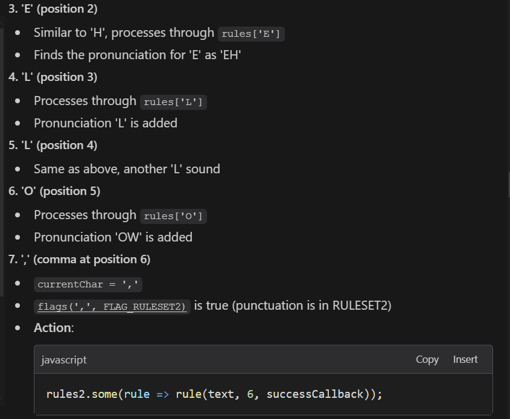
    - 
    - 
    - 

### decoding the myth behind result()

- is result a object or a function based on the below code snippet ?

```js
  const result = (text, inputPos, callback) => {
    if (matches(text, inputPos)) {
      if (process.env.DEBUG_SAM === true) {
        console.log(`${source} -> ${target}`)
      }
      callback(target, match.length);
      return true;
    }
  };
  result.c = match[0];

  return result;
```

- 
- hence,
    - when we do result.c -> its a object 
    - when we do result() -> its a function (function call has parentheses)

### understanding wht is returend in the line `const r = reciterRule(rule), c= r.c;` ... result as a fucntion or result as a object

```js
const rules = {};
tables.rules.split('|').map((rule) => {
  const r = reciterRule(rule), c= r.c;
  rules[c] = rules[c] || [];
  rules[c].push(r);
});
```

- 

### understand `function flow in reciter.es6`

#### 1. rules dict/rules2 dict -> (pre + match + post + target) + result function having closures of (matches + checkPrefix + checkSuffix) + result obj having c property ( signifying the match[0] character )

#### 2. TextToPhonemes function -> define inputPos + output string + checks if valid alphabet ( calls rule1 -> result() function ) + checks if valid number ( calls rules2 -> result() function ) + increment pos + append output

# Coding Peiod officially starts !

## 1st June'2025

### Added repo to github using Iceberg

- Repo Link : [PAM-GSoC-25-Project](https://github.com/neerja-1984/PAM-GSoC-25-Project)

- added tutorial to my ongoing Pharo tutorial repo 
  - Link : [Learn-With-Me-Pharo](https://github.com/neerja-1984/Learn-With-Me-Pharo)

### in later stages of project instead of Dictionary add a Trie to make it faster

- 

### Revised Pharo again ! 😊

## 7th June'2025

### Hehe need to buckle up fast now 😅

- revised the handwritten notebook notes
- revised the readme.md written notes ... so know everythign now 😇

### understanding `[options.phonetic]` in index.es6

- options.phonetic defines that wether our input string ( one we put in text box of SAM) is already phonemene string or not
- if it is phonemene string (HE2LL5OW) -> return it in caps 
- else convert the text ( normal english Hello) to its phonemene string 


#### how to change it to true .. can be done when making a new instance of it

 

### understanding `class-side` vs `instance-side` in pharo

- a brief :
  - 

  - `class side is equivalent to static methods`
    - 

  - `instance side is equivalent to defining methods on the objects only ( not on class directly)`
    - 

#### THUMB RULE :  as `CONSTANTS` are static -> should be on class side !!
  
- Example of class side method and how to call it  :
  - 

- Example of instance side method and how to call it:
  - 

#### Some other way to declare class-instance variable

- instance variable
  -  
- class variable
  - 

### FIRST ACHIEVEMENT : ❤️

- Commit Link : [PAM-GSoC-25-Project](https://github.com/neerja-1984/PAM-GSoC-25-Project/commit/e3e4a1ec4c4b0277bc561cacc0b639d71fae67af) 

- added reciter constants in pharo along with its tests  
- 


## 8th June'2025

### conversion of tables constants to pharo 

- Javascript Version to refer and make pharo code ! 😊
  - code at : [Mapping eng to decimal values](<Code Try Ons/3_SAM_map_alpha_to_decimal/index.js>)
  - output : 
  

- pharo version !! 😇
  - 
  - done with tests too !!!
    - 

## 11th June'2025

- Meet with Naheul and Domenico 
  - Discussed about all work done by me till now -> they are happy !
  - saw my written readme.md 
  - focus on completing the below test snippet 

```smalltalk
  testCollegePhoneme

	| phonemeOutput inputText  |
	inputText := 'COLLEGE'.
	
	phonemeOutput := reciter textToPhoneme: inputText.
  "reciter == a object of class that deals with actual text to phoneme conversion"

	self assert: phonemeOutput equals: 'KOW5ULEHG'.
```
	


## 13th June'2025

### understanding Pharo Method structure : 

- 

### understanding how we are trying to build this thing of Rules 

- structurally 
  - 
  -  

- example
  - *


- visual representation
  - 
  - 

### achievement :

- sucessfully converted the `alphabets rules` to PHARO 
- added the CRUD ops on it as well 
  - 

- tom -> all rest `alphabets + tests + puctuation`

## 15th June'2025

#### understanding `class side variables` and `class side instance variable` and `instance variable`

- a java to pharo comparison

|TYPE|JAVA|PHARO|
|--|--|--|
| Instance Variable| private int age;| instVars: #('name' 'age').|
| Class Variable| static int count = 0;| classVariableNames: 'TotalPeople.|
| Class Side Instance Variable|private static int config;| slots: { #logLevel }| 


- `instance variable` => each obj has one copy [ same for java + [pharo]]
  - 

-` class variables` => class has its copy [ in java its called static ]
  -  
  - similar to `public static int age;` 
  - coz of `public` -> all its subclass can have the same copy of the age variable
- `class side instance variable` => the class where it is defined only has the copy .. not shared in subclasses
  - 
  - similar to `private static int age;`
  - coz of `private` -> no subclass can use it
  - a secret safe place only for the class it is defined in !!


- 
- 

#### y we use class side instance varibales if static can be used?

- its a safe secret place for the class
- some uses are : 
  - 
  - 


#### understanding `classPool`
  - Every class can have `class variables` (shared among all instances of the class and its subclasses). 
  - Pharo stores these varibles in they're kept in a special dictionary called the classPool.
  - so you can get the key - value pair of class Variables 

- code to acess the class variables via `class pool`
```smalltalk
"syntax:"
"ClassName classpool at: classVariableName"

| rules |

rules := A classPool at: #RulesDictionary. 

Transcript show: 'Access class Variables via class pool'.

Transcript show: (A classPool at: #RulesDictionary) size printString; cr.

rules do: [ :rule |
    Transcript
        show: rule pattern;
        show: ' =>';
        show: rule replacement;
        cr
].

Transcript open.
```

- 

#### some mistakes while using classvariable

- class A defintion -> it has a class variable `RulesDictionary` which we can access via `class pool`

- also definition of `initializing method`

```smalltalk
"class definition"

LetterRules << #A
	slots: {};
	sharedVariables: { #RulesDictionary };
	tag: 'Rules';
	package: 'PAM-Core'

"initliazation method"
initialiseRules
    "Initialize rules for letter A"
    RulesDictionary := OrderedCollection new.

    "Add all A rules"
    self addRule: ' (A.)' replacement: 'EH4Y.'.
    self addRule: '(A) ' replacement: 'AH'.
```
- error : 
- solution : 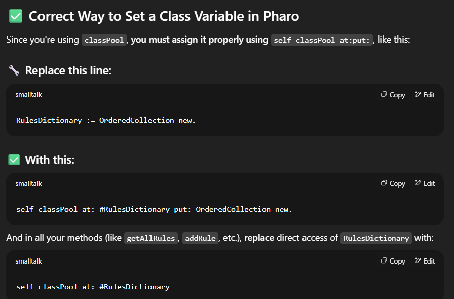

```smalltalk
"hence our intiliazation method becomes "

initialiseRules
    "Initialize rules for letter A"
    self classPool at: #RulesDictionary put: OrderedCollection new.

    "Add all A rules"
    self addRule: ' (A.)' replacement: 'EH4Y.'.
    self addRule: '(A) ' replacement: 'AH'.
```


#### how to create class and subclass in Pharo

- class creation :

```smalltalk
Object subclass: #Rules
    instanceVariableNames: 'pattern replacement'
    classVariableNames: ''
    poolDictionaries: ''
    category: 'PAM-Core-Rules'.
```

- subclass creation :

```smalltalk
Rules subclass: #AdvancedRules
    instanceVariableNames: 'priority'
    classVariableNames: ''
    poolDictionaries: ''
    category: 'PAM-Core-Rules'.
```

- checking is subclass or not ?

```smalltalk
AdvancedRules superclass.   "Returns: Rules"
```

#### The current pharo uses `ShiftClassBuilder` format to define classes

#### setup and tearDown  methods

- 

#### achivements :

- refactored code [ like names of classes + variables]
- parent and child relation achieved .. things make better sense now
  - added doubts on discord + asked Nahuel.. as wanted aall methods to be in parent class .. only intialisation method in child
- test case added [ also achived a functionality by setUp and tearDown .. that the orignal Dictionary dosent get disturbed when running testcases !]
- replied to Domenico on mail

- pic of the day 😊 
  


## 17th June'2025

- receieved a reply on discord + github issue + mail reply highlighting coding practises 

- here's a ref : [Top down approach](https://github.com/neerja-1984/PAM-GSoC-25-Project/issues/1)

- here's a gpt of wht is expected of me .. did not understand at first 😢
  - 
  - 
  - 
  - 

- so well i need to do a top down approach -> think about the prob at large ... and solve from the point of view of a user .. not the coder
- meaning .. not how to code [ this is wht i did wrong .. i did constants and tables code etc etc ] ... then did the oops level thing [ static , parent , child .. etc etc]

### `the question of how to code -> has many answers .. it will bring in many design principles`

### `in the path of how to answer thethe above -> we loose the wht the issue was .. the user problem`

### `do not do that`

### `hence try tdd , take a step back and analyze the exact problem before falling in this trap`

  - 
  - 

- with that said .. this is what Nahue expects : 
  -  
  - 
  - 
## 18th June'25

- meet with Nahuel and Domenico -> recieved certain feedback : 


1) Remove unnecessary loggers from test.
2) Add a transcript of steps of text to phoneme conversion when writing reciter code. 
3) change word 'replacement' to 'phoneme' in the methods.
4) add a 'matchFor: pattern' in the methods


## 23rd June'25

- 

### doing a pharo code conversion of reciter.es6 logic : 

#### finding prefix pattern suffix of every rule's LHS : 
- pharo index starts at 1
- 

- so for rule : `#:^(I)^#`
  - $( : 4
  - $) : 6
  - length of string : 8
  - prefix : `#:^` [ 1 to 3 ]
  - pattern : `I` [ 5 to 5 ]
  - suffix : `^#` [ 7 to 8 ]


- 
- output : 

#### checking of isSpecialCharacter

```smalltalk
isSpecialCharacter: char at: position in: text
    "Check if the character should be treated specially"
    | flags |
    flags := Flags flagsFor: char.
    "Check if character is not alphabetic or quote"
    (flags anyMask: 128) not  "FLAG_ALPHA_OR_QUOT"
        ifTrue: [ ^ true ].
    
    "Check for period not followed by a number"
    (char = $. and: [ 
        (position + 1 > text size) or: 
            [ ((Flags flagsFor: (text at: position + 1)) anyMask: 1) not ]  "FLAG_NUMERIC"
    ]) ifTrue: [ ^ true ].
    
    ^ false
```

- so in rule processing ... special characters [ alphabets , fullstop at end .. etc have impt]

- 
- use of anymask a utility helper to check and: things : 

- 

## 24th June'25

- achievement of the day : added rules for `HELLO` word + code addition of `textToPhoneme method`

- 

- lets see if it works 😉

## 28th June'25

### `in @reciter.es6 , wht is happening ? are all rules being checked for a character and best one is returened ? or only yht frirst best is found and returned ?`


- what i did -> check for all rules -> which fit the pattern in input text we are trying to replace
- then return the longest pattern match 
  - like if 2 rules match (B)->B and (BREAK) -> BRE5K
  - return BREAK !!

  - why so ?
    - the shorter one will match the pattern first `as in matched in BREAK irrespective`
    - but the longer one will be the correct one which needs to be matched

### kindaa i can say ... the multiple parts of textToPhoneme function work 


### understading our `matchSpecialCharacter: char in: text at: position direction: dir` method

#### first the JS version with examples : 

- 
- 
- 
- 
- 

- each of these special characters like `@ # ^` have same logic -> its just the direction of search is different

```js
// in checkSuffix 

// '#' - next char must be a vowel or Y.
'#': () => flagsAt(text, ++pos, FLAG_VOWEL_OR_Y),

// in checkPrefix 

// '#' - previous char must be a vowel or Y.
'#': () => flagsAt(text, --pos, FLAG_VOWEL_OR_Y),
```

### `textToPhoneme` works words of A and B !! ❤️

- a quick meet with Nahuel helped in denugging the code : therefore the textToPhoneme method ran !
  - 

- wrote a green and yellow text too !!! ❤️
  - 
  - yellow coz rules for that word need to be implemented as well

- discussion in meet 
  - debug why rules for H E L O aint comming in Dictionary 
      - ( thanks to Nahuel i could understand that my rules parsing was not correct -> was adding a `=` while intilising rules)
      - `^ output` was causing th error in textToPhoneme -> thanks agaian Nahuel
      
  - make these two test yellow
  - post that we need to stop reciter -> than focus on Phausto implementation ( parser at a later stage !)

### why do we need to add space at strat of word ?

- as seen here .. every letter which is at start needs a space to denote it is a starting letter word ... 
- 
- hence in smalltalk 'textToPhoeneme' we add space to start of word

```smalltalk
textToPhonemes: input
    "Convert input text to phonemes"
    | text output pos charFlags rule currentChar |
    text := '  ',input asUppercase. "Pad with space to justify start of a word"
    output := ''.
    pos := 1.

    "rest of code .."
```

### achievement of the day 1:

- `textToPhoeneme worksssss 
- 
- 

### achievement of the day 2:

#### let's make a logger like Springboot's Sl4j 

```smalltalk
log: message

    | senderContext className methodName |
    
    "Get the sender context (the method that called log:) -> so the parent method inside which log: is called is picked up from here"
    senderContext := thisContext sender.
    className := senderContext method methodClass name.
    methodName := senderContext selector.
    
    Transcript
        nextPutAll: '[';
        nextPutAll: className;
        nextPutAll: ' >> #';
        nextPutAll: methodName asString;
        nextPutAll: '] ';
        nextPutAll: message;
        cr.
    Transcript flush
```
- `debugmode` is a class variable which is initally false -> hence nothing seen in transcript
  - 

- let's make it true !
  - 
  - 

#### removed leading and trailing spaces from output

```smalltalk
"via this line in textToPhoneme at the end before returnign output"

"Remove leading and trailing spaces"
output := output trimBoth.
```

- 


## 29th June'25

### Quick meet with Domenico on using TpSamplee and playing numbers:

- numbers folder -> put in pharo image 

- in playground -> find the location of folder :
pathToFolder := FileLocator image asAbsolute pathString , '/numbers'.

- use TpSampler : is a sample player ( sample : piece of recorded music .. like number folder )

- pathToNumbers := FileLocator  imageDirectory asAbsolute pathString , '/numbers'. 

- samplePlayer := TpSampler new pathToFolder: pathToNumbers

- `ctrl+B  -> shortcut to go in browser of class`

- folder for number then next folder for alpabets


- a simple tests we need to achieve 
```smalltalk
pathToNumbers := FileLocator  imageDirectory asAbsolute pathString , '/numbers'. 

samplePlayer := TpSampler new pathToFolder: pathToNumbers .

dsp := samplePlayer stereo asDsp.

| samplePlayer |

self deny: samplePlayer stereo asDsp isNull.
```

- make a tag inside Pam-Core : instrument
- name as PamNumberSampler
- PAMDSP -> classSide : sayZeroSample , 

#### study pragma in pharo

- code snippets taken from the meet


- adding label 


- dsp trace allParams 


- triggering the buttons with code 


- pragma


- `<script>` makes test like playing ( run the class ) in class side
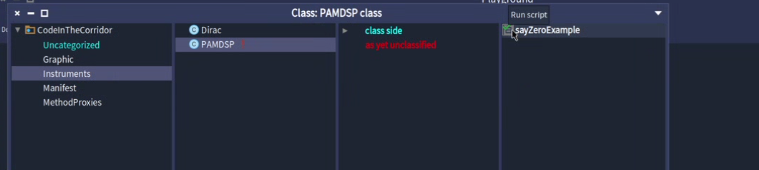

```smalltalk
sayZeroExample
<script>
pathToNumbers := FileLocator  imageDirectory asAbsolute pathString , '/numbers'. 

samplePlayer := TpSampler new label: 'Numbers'; pathToFolder: pathToNumbers .

dsp := samplePlayer stereo asDsp.
dsp init.
dsp start.
dsp setValue: 0 parameter: 'NumbersIndex'.
dsp trig: 'NumbersGate'.
```


- learn process in pharo ( multithread ) 
  - see if timeRepeat is a process
- 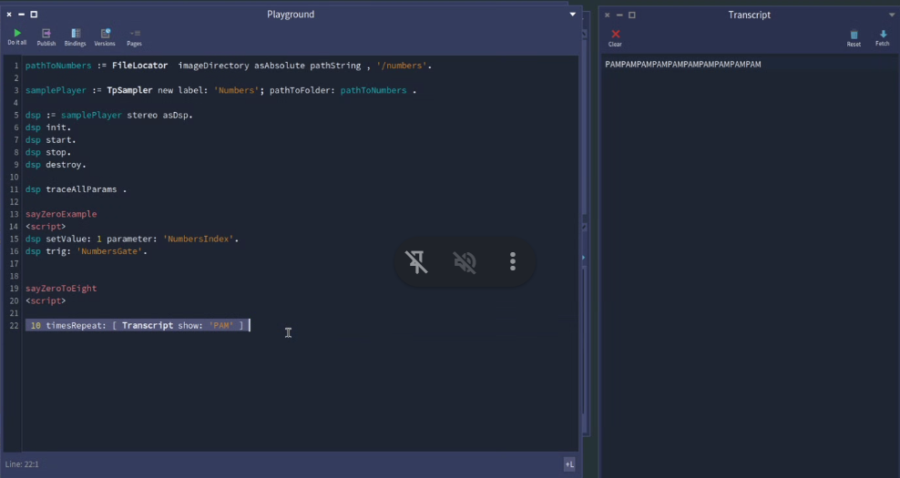

-  
  - use fork

- use fork with delay in time
  - 
  - delay between in each phoenme ( h -> 1sec later e -> 1 sec later l .. etc)

- play all numbers in a line 
  - 


- goal for this week : run code line at 29
  - 
  - smth like this : 

```smalltalk
"THIS IS BADDDDDDDD , BUT LOOK AT THE DEBUGGER ! myString := '1 2 3 4'."

[  myString do:  [ : i |
		dsp setValue: i  parameter: 'NumbersIndex'.
       dsp trig: 'NumbersGate'.
  
		. 1 seconds wait ] ] fork
```

- endgoal 2 : take a string : from sampler play audio 


```smalltalk
"you can make another example: "

sayOneToFour
myString := '1 2 3 4'.

[  myString do:  [ : i |
		dsp setValue: (myString indexOf: i ) parameter: 'NumbersIndex'.
       dsp trig: 'NumbersGate'.
  
		. 1 seconds wait ] ] fork
```

### important book to understand phonetic sounds -> will come handy !!

[Sounds of Spoken English : internet link](https://www.dei.ac.in/dei/books/files/pdf/spokenEnglish/Sections/SpokenEnglish-Section1-TheSoundSystemOfEnglish.pdf)


[Sounds of Spoken English : downloaded ](Books/SpokenEnglish-Section1-TheSoundSystemOfEnglish.pdf)

## 5th July'25

### Achievement of the day : 😇


- added all letter rules 
- tried a few conversions -> working fine ( needs some refining --> but this is good to start !!!! )

## 6th July'25

-  🌻


### Achievement of the day --> completed all tests for all words 
- `textToPhoneme works fine` ❤️


- sentence also works fimne ... but ... space consideration needs to happen --> WILL do in next phase !

### Starting a fresh -> downloading Phausto to start with the reciter 

- 

### differnce in mono and stereo and bringing out audio !!: 

- 

- the code worked .. u need to select the entire thing for it to work .. doing it line by line .. will throw error 😢

- but here's the code whihc worked
  - 

- some `displayUI` magicccc 
  - 

- adding labels
  - 

- triggering buttons without the UI

  - learning wht each control button is called : 
    - 

  - triggereing them .. chaging their values
    - 

- playing numbers audio

1) all in a 0 to 9 format -> we need to fix 7 , 8 , 9 .. as they are not audible 😢

2) playing the numbers in a predefined list format


- made their respective methods !!
- entire code !!!

```smalltalk
| pathToNumbers samplePlayer dsp |

pathToNumbers := FileLocator imageDirectory asAbsolute pathString , '\numbers' "'C:\Users\Neerja\Documents\Pharo\images\PAM v1\numbers'". 
samplePlayer := TpSampler new label: 'NumberAudio' ; pathToFolder: pathToNumbers. "a TpSampler"

dsp := samplePlayer stereo asDsp. "a DSP(@ 16r1BA1931ECC0)"

dsp init. "a DSP(@ 16r1BA1931AD60)"

dsp start. "true"

dsp traceAllParams. "a DSP(@ 16r1BA2A25D4F0)"

dsp setValue: 5 parameter: 'NumberAudioIndex'. "a DSP(@16r1BA2A25E6E0)"

dsp trig: 'NumberAudioGate'. "a DSP(@ 16r1BA2A25EC00)"

dsp displayUI "a BlSpace('MyApp UI')".

dsp stop. "a DSP(@ 16r1BA1AE11D30)"

dsp destroy. "a DSP(@ 16r1BA23FB4D70)"


"playing all numbers"
(0 to: 9) do: [:i |
    dsp setValue: i parameter: 'NumberAudioIndex'.
    dsp trig: 'NumberAudioGate'.
    (Delay forSeconds: 1) wait.  "Pause 1 second between numbers"
].

"playing in a predefined list manner"
#(5 3 1 9 0) do: [:i |
    dsp setValue: i parameter: 'NumberAudioIndex'.
    dsp trig: 'NumberAudioGate'.
    (Delay forSeconds: 1) wait.
].
```

### andddd best part pf the day !!! 😍

- made methods to do this 
  - 
  - the best commit !! : [first DSP commit  ](https://github.com/neerja-1984/PAM-GSoC-25-Project/commit/5ace694728171396dc0c16345056d078cf7a4f13)

  - also opened a issue side by side in phausto -> coz it was error causing when i was coding about it  ---> [Phausto Issue](https://github.com/lucretiomsp/phausto/issues/60)

## 7th July'25

- asked doubt about pragmas on Discord ... turns out they are just annotations like @Service in springboot

- 


## 9th July '25 -- a quick call with Domenico

- why test fails:
  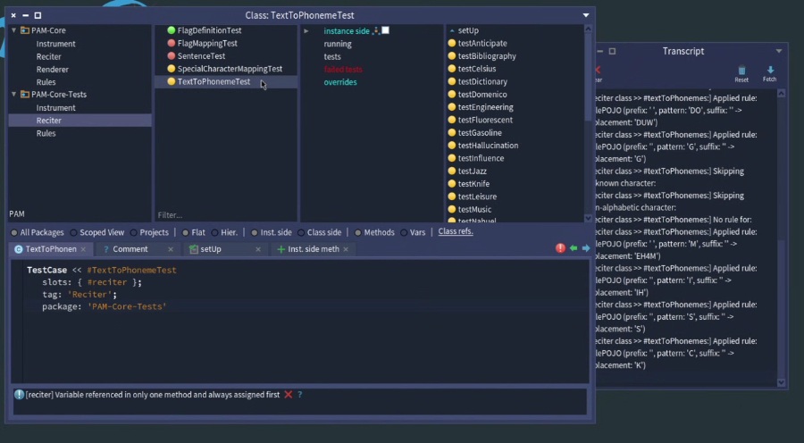


- setup method .. to intilizise everythign .. 
- make a new image -> pull the repo -> to check wht is missing .. where are the inconsistenecies. 


- pragma error resolve 
  - 

  - 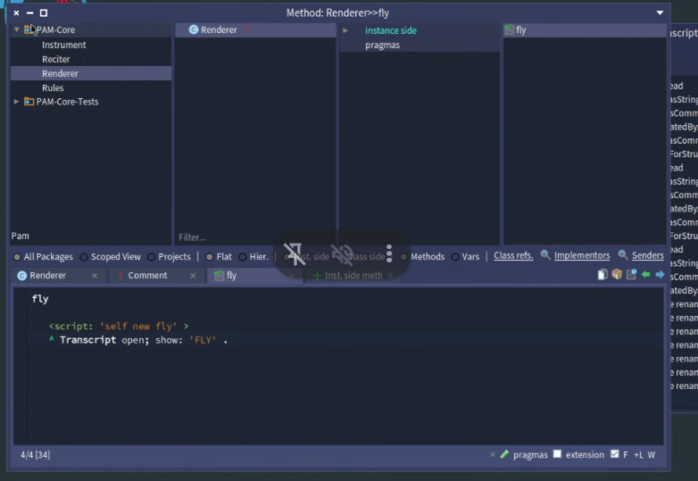

- issue opened in discord :
  - 

- corrcet this :
- 
- 

```smalltalk
AlphabetUtility initializeDictionary.
Reciter textToPhonemes: 'music'.
Domenico Cipriani
14:32
playAllNumbersWithDelay
	"plays all numbers in a linear fashion"

	[(0 to: 9) do: [ :i |
			dsp setValue: i parameter: 'NumberIndex'.
			dsp trig: 'NumberGate'.
			(Delay forSeconds: 1) wait ] ] fork
```


- mac vs window folder issue 
- eval feedback : 

- slow at first -> but new to pharo so understable 
- on pace now 
- have some not working code then no code at all 
- do reciter complete ( tests intilizations + instarument bugs ) -> move to parser 

- from parser we need duration and stress

## 19th July

### learned how to take pull in a new image :

- add the ssh clone link from repo
  - 
  - this shall clone the repo ... but but ...
  - it shall give u `package not loaded` error
  - 

- fix for package not loaded : `METHOD 1`

  - u need to load packages individually
  - 
  - 

  - now packages are up to date :
  - 

- fix for package not loaded : `METHOD 2`
  - we need to have a baseline Metacello ... need to with Domenico / Nahuel for this
  - see this vid at time stamp `12:30`
    - [Iceberg Clone Link at 12:30](https://www.youtube.com/watch?v=K70fiNJvPCY&t=750s)
  - Metacello is like a package manager for Pharo (just like pip , npm .. loads packaged automatically)
  - so u need to have a `Package Metacello baseline !!`


```smalltalk
  "A initialiseRules."
"A printRules."
"A getAllRules."

LetterRules initialiseRules. "LetterRules"
N getAllRules.
N addRule: 'NN' replacement: 'NENE'. 
Reciter textToPhonemes: 'NN'. "'NENE'"

M printRules.

M classPool .
M initialiseRules.
M printRules.
M printRules.

LetterRules removeRule: 'M' replacement: 'EH4M'. 

Transcript open.
AlphabetUtility initializeDictionary. 
AlphabetUtility rulesFor: $M.


Reciter textToPhonemes: 'nAHUEL'. "'NAE/HYUWEHL'"

Reciter textToPhonemes: 'MONA'. "'EH4MOWNAE'"

"og:"
Reciter textToPhonemes: 'Domenico'. "'DOWMEHNICAA'"
Reciter textToPhonemes: 'Magnificent'. "'MEY5GNIFICEHNT'"
Reciter textToPhonemes: 'Emirates'. "'EHMIRAETEHS'"

"new:"
Reciter textToPhonemes: 'Domenico'. "'DUWMEHNIHKOW'"
Reciter textToPhonemes: 'Magnificent'. "'EH4MEY5JNIHFIHKEHNT'"
Reciter textToPhonemes: 'Emirates'. "'EHMAYRAETEHS'"
``` 

### making synchronous calls asynchronous 

- wait vs fork
- 

- 
- the wait used to block pharo -- cant do anything else, not even type 
- [▶ Watch demo](Readme/readme-images-vc/20250719-1230-43.9867889.mp4)
- Live demo :<video controls src="Readme/readme-images-vc/20250719-1230-43.9867889.mp4" title="Title"></video>

- hence we use, fork : 
- 
- [▶ Watch demo](Readme/readme-images-vc/20250719-1228-55.4828975.mp4)
- Live demo : 
<video controls src="Readme/readme-images-vc/20250719-1228-55.4828975.mp4" title="Title"></video>

### refactorings in `instrument class`
-  so now we dont need to hardcode label as in this commit ... 
- have made a genralzed method --> and the folder specific methods calls the genralized method .. setting parameters

```smalltalk
"generalized"
initilizeWithLabel: aLabel folderName: aFolderName 
	"a generalised method to set label and folder Name in Windows environment !"
    | path |
    path := FileLocator imageDirectory asAbsolute pathString ,  , aFolderName.
    
    samplePlayer := TpSampler new 
        label: aLabel; 
        pathToFolder: path.

    dsp := samplePlayer stereo asDsp.
    dsp init.
    dsp start.

"folder specific methods"

initializeNumbersFolder
	"pre requisite --> have the numbers audion folder in image directory"
	self initilizeWithLabel: 'Number' folderName: 'numbers'.
```


- so this is how it works now : 
```smalltalk
|mydsp player|

"old method -- forget this .. just for ref"
mydsp:= PAMDsp new.
mydsp playAllNumbersWithDelay.
mydsp playNumbers: #( 0 0 7 8 6).
mydsp cleanup.

"new method .. use this !"
player := PAMDsp new.
player initializeNumbersFolder.
player playAllNumbersWithDelay.
player playNumbers: #(1 3 5 7).
```

### quick meet with Domenico 

- make an array of this: (aka replacement for us)
- 


- the big picture 
- 

- for me to pass the eval .. make the thing speak -- use replacement from here 😂
- 


- windows macos path discussion
```smalltalk
OSPlatform current isMacOSX
OSPlatform current isWindows
```

#### quick notepad notes

- in every mp3 file --> the amplitude wave is of -1 to 1
- [ they render a array of amplyude values .. 0.4 , 0.5 , 0.55 .. ]

- we doing concatenative synthesis -> add phonemen audio together 

```smalltalk
diphones = [
    'IY', 'IH', 'EH', 'AE', 'AA', 'AH', 'AO', 'UH', 'AX', 'IX',
    'ER', 'UX', 'OH', 'RX', 'LX', 'WX', 'YX', 'WH', 'R*', 'L*',
    'W*', 'Y*', 'M*', 'N*', 'NX', 'DX', 'Q*', 'S*', 'SH', 'F*',
    'TH', '/H', '/X', 'Z*', 'ZH', 'V*', 'DH', 'CH', 'J*',
    'EY', 'AY', 'OY', 'AW', 'OW', 'UW', 'B*', 'D*', 'G*', 'GX',
    'P*', 'T*', 'K*', 'KX', 'UL', 'UM', 'UN'
]

"make an array of this: "
Reciter textToArrayOfPhonemes" aString

Reciter textToArrayOfPhonemes: 'celsius'
^ #('*' 's*' 'eh' 'lx' 's*' 'ih' 'ah' 's*')
```

- write a test .. taht covered all 47 phonemen
- textToArrayOfPhonemeTest ---> cover all words from textToPhoneme Tests


#### todos
- make array of replacements ( arrayOfPhoneme )
- add numbers folder in repo
- add readme !!

### correct version of making pragmas -- learnt from Domenico!!

```smalltalk
playAllNumbersWithDelay
"pragma for the above method"
  
	<script: 'PAMDsp new playAllNumbersWithDelay'> " --- incorrect .. no need of adding class-methodname"
	<script: 'self playAllNumbersWithDelay'> " --- correct .. add self methodname"
	
	|player|	
	player := PAMDsp new.
	player initializeNumbersFolder.
	player playAllNumbersWithDelay.
``` 

### windows and Mac folder issue solved !!

- undersatnding path separators
- 

- therefore in this commit .. added `pathSeparator` logic
- [commit link](https://github.com/neerja-1984/PAM-GSoC-25-Project/commit/c8b161fe788046460824d51ff44d5d677207d02b)


### two major bugs fixed !! --> acheivement of the day ❤️

#### 1) reason why sentence parsing wasn't correct

- in textToPhoneme --> when we want to skip characters .. we should not add the pos
  - 
  - 

#### 2) reason why we used to get wrong phonemes for certain words

- exmaple : 
- in the rules dictinary of every letter --> we used to have simple rule .. ie `addRule: '(G)' replacement: 'G'` in the end
- we also have another rule `addRule: ' (G)' replacement: 'JIY4'` .. ie. start of word rule

- as we select the rule with longest pattern --> we do not overwrite --> hence, we used to have this rule in the above image: `addRule: ' (G)' replacement: 'JIY4'`

- becaus of this --> `sunflower` had smth like the image above
- hence we do 2 things --
  - 1st 
    - change the order of rules in the resp POJO
    - 
    - so from next repo pull onwards --> same mistake not repeated

  - 2nd 
    - in the current image .... remove and add rule such that ... the the order is maiantained .. hence .. correct rule matching 
    - 
    - see the below code for having the order mainatained

- 

```smalltalk
G removeRule: ' (G)' replacement: 'JIY4'.
G removeRule: '(G)' replacement: 'G'.
G addRule: '(G)' replacement: 'G'.
G addRule: ' (G)' replacement: 'JIY4'.
G getAllRules.


F removeRule: ' (F)' replacement: 'EH4F'.
F removeRule: '(F)' replacement: 'F'.
F addRule: '(F)' replacement: 'F'.
F addRule: ' (F)' replacement: 'EH4F'.
F getAllRules.

J removeRule: ' (J)' replacement: 'JEY4'.
J removeRule: '(J)' replacement: 'J'.
J addRule: '(J)' replacement: 'J'.
J addRule: ' (J)' replacement: 'JEY4'.
J getAllRules.

K removeRule: ' (K)' replacement: 'KEY4'.
K removeRule: '(K)' replacement: 'K'.
K addRule: '(K)' replacement: 'K'.
K addRule: ' (K)' replacement: 'KEY4'.
K getAllRules.

K removeRule: ' (K)' replacement: 'KEY4'.
K removeRule: '(K)' replacement: 'K'.
K addRule: '(K)' replacement: 'K'.
K addRule: ' (K)' replacement: 'KEY4'.
K getAllRules.

L removeRule: ' (L)' replacement: 'EH4L'.
L removeRule: '(L)' replacement: 'L'.
L addRule: '(L)' replacement: 'L'.
L addRule: ' (L)' replacement: 'EH4L'.
L getAllRules.

M removeRule: ' (M)' replacement: 'EH4M'.
M removeRule: '(M)' replacement: 'M'.
M addRule: '(M)' replacement: 'M'.
M addRule: ' (M)' replacement: 'EH4M'.
M getAllRules.

N removeRule: ' (N)' replacement: 'EH4N'.
N removeRule: '(N)' replacement: 'N'.
N addRule: '(N)' replacement: 'N'.
N addRule: ' (N)' replacement: 'EH4N'.
N getAllRules.

P removeRule: ' (P)' replacement: 'PIY4'.
P removeRule: '(P)' replacement: 'P'.
P addRule: '(P)' replacement: 'P'.
P addRule: ' (P)' replacement: 'PIY4'.
P getAllRules.

R removeRule: ' (R)' replacement: 'AA5R'.
R removeRule: '(R)' replacement: 'R'.
R addRule: '(R)' replacement: 'R'.
R addRule: ' (R)' replacement: 'AA5R'.
R getAllRules.

S removeRule: ' (S)' replacement: 'EH4S'.
S removeRule: '(S)' replacement: 'S'.
S addRule: '(S)' replacement: 'S'.
S addRule: ' (S)' replacement: 'EH4S'.
S getAllRules.

T removeRule: ' (T)' replacement: 'TIY4'.
T removeRule: '(T)' replacement: 'T'.
T addRule: '(T)' replacement: 'T'.
T addRule: ' (T)' replacement: 'TIY4'.
T getAllRules.

V removeRule: ' (V)' replacement: 'VIY4'.
V removeRule: '(V)' replacement: 'V'.
V addRule: '(V)' replacement: 'V'.
V addRule: ' (V)' replacement: 'VIY4'.
V getAllRules.

W removeRule: ' (W)' replacement: 'DAH4BULYUW'.
W removeRule: '(W)' replacement: 'W'.
W addRule: '(W)' replacement: 'W'.
W addRule: ' (W)' replacement: 'DAH4BULYUW'.
W getAllRules.
```


### some more happy news today !!

- GSOC midterm eval passed !! --> worthwhile feedback received from mentors 😊
  - 

- first half of stipend received !! 😃
  - 


## 30th July '25

### Understading the different ways in which we have phoneme representation

- ARPABet : capital letters ( SAM uses this )
- IPA : greek letters

- Links to understand : 
  - [IPA with Example words](https://gist.github.com/walkoncross/33059e1249a24d7596a7abb8c5cec986#-vowels)

  - [ARPA to IPA table + python coversion code of ARPABet to IPA](https://github.com/chorusai/arpa2ipa?utm_source=chatgpt.com)

### code to get the ARPA format audio samples from SAM

```js
const fs = require('fs');
const path = require('path');
const { Sam } = require('./sam'); // Adjust path if necessary

const phonemes = [
  "AA", "AE", "AH", "AO", "AW", "AY",
  "B", "CH", "D", "DH", "EH", "ER",
  "EY", "F", "G", "HH", "IH", "IY",
  "JH", "K", "L", "M", "N", "NG",
  "OW", "OY", "P", "R", "S", "SH",
  "T", "TH", "UH", "UW", "V", "W",
  "Y", "Z", "ZH"
];

// Create output directory
const outDir = path.join(__dirname, 'phonemes_wav');
if (!fs.existsSync(outDir)) fs.mkdirSync(outDir);

// Function to synthesize and save
phonemes.forEach(ph => {
  const sam = new Sam();
  sam.sayPhonemes(ph); // Core phoneme input
  const wavBuffer = sam.toWav(); // Get WAV as buffer
  fs.writeFileSync(path.join(outDir, `${ph}.wav`), wavBuffer);
  console.log(`Saved ${ph}.wav`);
});

// to run 
// node generatePhonemeAudio.js
```

### difference in what Domenico gave ( Diphones ) vs what we are downloading ( Phoneme )

```js
// Domenico's list
diphones = [
    'IY', 'IH', 'EH', 'AE', 'AA', 'AH', 'AO', 'UH', 'AX', 'IX',
    'ER', 'UX', 'OH', 'RX', 'LX', 'WX', 'YX', 'WH', 'R*', 'L*',
    'W*', 'Y*', 'M*', 'N*', 'NX', 'DX', 'Q*', 'S*', 'SH', 'F*',
    'TH', '/H', '/X', 'Z*', 'ZH', 'V*', 'DH', 'CH', 'J*',
    'EY', 'AY', 'OY', 'AW', 'OW', 'UW', 'B*', 'D*', 'G*', 'GX',
    'P*', 'T*', 'K*', 'KX', 'UL', 'UM', 'UN'
]

// my list
phonemes = [
  "AA", "AE", "AH", "AO", "AW", "AY",
  "B", "CH", "D", "DH", "EH", "ER",
  "EY", "F", "G", "HH", "IH", "IY",
  "JH", "K", "L", "M", "N", "NG",
  "OW", "OY", "P", "R", "S", "SH",
  "T", "TH", "UH", "UW", "V", "W",
  "Y", "Z", "ZH"
];
```

- Phonemes -- standalone :
  - 
  - 

- Diphones -- the blend of second half of first phoneme and first half of second phoneme : 
  - 
  - 

- in terms of count of both :
  - 

- diffference in `/` and `*` in diphones : 
  - 
  - 

  - example :
    - 
    - 

### grapheme ( the way we write sounds in simple eng )

- 
- 


### actual conversion

- the audio files we have are having these phoneme :
  - 
  - they have named some as `colon`
  - like this : 

### Code changes 

- `Reciter textToPhoneme` method now returns array of phoenems .. insyead of a string
- 

- we then convert the phoneme array to IPA format ( we will connect audio via this !! 😗)

#### steps for phoneme --> IPA conversion ( as per filenames)
#### we used recursion and greedyyy approachhhhh 😭😎❤️
- 

```smalltalk
"code to run"
|PAMPhonemeString|

PAMPhonemeString:= Reciter textToPhonemes: 'Czech Republic.'.
PAMPhonemeString. "#('S' 'Z' 'EH' 'K' 'RIY' 'P' 'AH5' 'B' 'L' 'IH' 'K')" 

PhonemeToIPAConvertor initializeDictionary.
PhonemeToIPAConvertor convertPAMPhonemeToIPAFormat: PAMPhonemeString.  

"#('s' 'z' 'e' 'k' 'r' 'i_colon' 'p' 'ʌ' 'b' 'l' 'i' 'k')"
```

  - strip the phoentic string of any digits ( these are our stress markers .. we dont need them here )

  - make a dictionary -> where we store basic phoneme to IPA 
    - 

  - for every phoneme we got from `textToPhoneme` method --> check if a direct conversion is available in dictionary
    - if yes --> we got our IPA
    - if no --> we have compound Phoneme `RIY --> R + IY`

    - for them we use `recursion` --> greedy approach ( match the longest possible pattern available in dictionary .. recurse to small then)


```smalltalk
splitCompoundPhoneme: PAMPhoneme
	"Split compound phoneme into known phonemes using a greedy approach --> ie longest first"
	| stripped size result pos found |
	stripped := self stripStressMarkersInPhoneme: PAMPhoneme.
	size := stripped size.
	result := OrderedCollection new.
	pos := 1.

	[ pos <= size ] whileTrue: [
		found := false.
		(size to: pos by: -1) do: [ :end |
			| slice |
			slice := (stripped copyFrom: pos to: end).
			(IPAConversionDictionary includesKey: slice) ifTrue: [
				result add: slice.
				pos := end + 1.
				found := true.
				^ result , (self splitCompoundPhoneme: (stripped copyFrom: pos to: size)) "recurse on the rest"
			]
		].
		found ifFalse: [
			result add: (stripped copyFrom: pos to: pos).
			pos := pos + 1.
		]
	].

	^ result
```

- exmaples of abpve recursion code 
  - 
  - 


### Todo 

- add these `github badges on pharo project readme` 
  - [badge link](https://github.com/hernanmd/badges)

### creating our project baseline :

- 
- 

#### dependencies loaded ?

- 
- 

#### so our metacello script now becomes !!!  😎
  
- 

```smalltalk
Metacello new
    baseline: 'PAM';
    repository: 'github://neerja-1984/PAM-GSoC-25-Project:master/src';
    load.
```

#### let's try loading metacello in a new image !!

- error ( metacello conflict )
  - 

### sucessfully added numbers audio files in github repo 

- 

## 4th Aug : Quick Meet with Domenico

#### reason why code not working --> reason for this bug 


- need to Modify TPSmapler --> as now only WideString (will not consider IPA characters )
- hence doemico added ByteString instead of Widestring  --> need to pull Phausto iamge again ! 

```smalltalk
"do this again :"
Metacello new
 baseline: 'CoypuIDE';
 repository: 'github://pharo-graphics/CoypuIDE/';
 onConflict: [ :ex | ex useIncoming ];
 onUpgrade: [ :ex | ex useIncoming ];
 load

 "later do a git pull"
```   

#### some other error 

1. metadata issue:
- audio files to run in phausto --> should not have metadata
- hence : https://online-audio-converter.com/ --> removes metadata from files

2. libsndfile issue:
- https://en.wikipedia.org/wiki/Libsndfile
- It seems like you're referring to libsndfile, a library used for reading and writing sound files. If libsndfile is not reading files with metadata correctly, there could be several reasons for this issue. Here are some steps you can take to troubleshoot and potentially resolve the problem:

- Check the File Format: Ensure that the file format you are trying to read is supported by libsndfile. Some formats might not support metadata or might require special handling.
the libdynamic-engine.dylib that Phausto is using is linked to libsndfile to read audio files

- we can fix this issue only by fixing libsndfile hard work with C!

#### instead of a new class --> make this in Reciter textToIPAPhonemes method

```smalltalk
textToIPAPhonemes: aString

	^ PhonemeToIPAConvertor convertPAMPhonemeToIPAFormat:
		  (self textToPhonemes: aString)
```

- 

#### a small bug fix i need to do 
```smalltalk
giftPhonemes := Reciter textToPhonemes: 'gift'.
#('G' 'IH' 'F' 'T')

giftIPAString := Reciter textToIPAPhonemes: 'gift'.
^ #('g' 'i' 'f' 't')
```

- hence map IH --> i_colon

- 
- 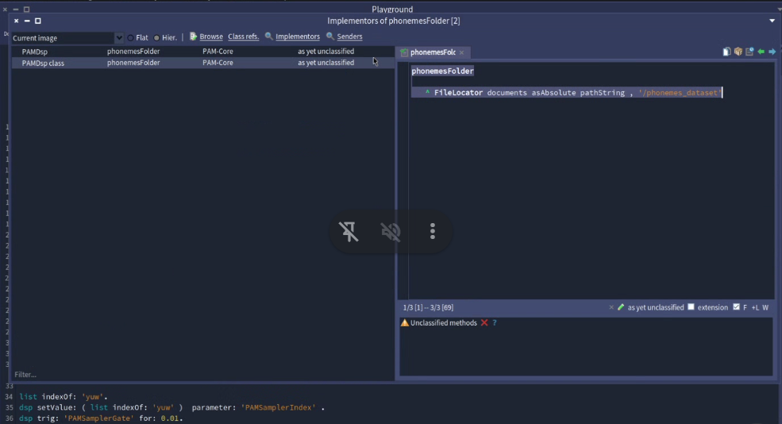


#### what are we targetting by gsoc end ?

- 
- 

#### todo 
- add all tests from testToPhoneme -> textToIPAPhonemes
- https://en.wiktionary.org/wiki/gift : for checking how the IPA phoneme sounds
- add audio folder in documents folder path rather than image 
- textToIPAPhonemes --> in Reciter class
- see the bugs in testToPhoneme --> 
- add the phoneme_dataset
- pull phausto

#### code snippets Domenico shared

1. 
```smalltalk
"in PAMDSP class; "
phonemesFolder
	^ FileLocator documents asAbsolute pathString , '/phonemes_dataset' -
```

- 

2. 

```smalltalk
sampler := TpSampler new pathToFolder: PAMDsp phonemesFolder; label: 'PAMSampler
sampler sampleNamesSorted
```

- 

3. 
```smalltalk
dsp := sampler stereo asDsp.
dsp init.
dsp start.
myString := Reciter textToIPAPhonemes: 'hello'.
[myString do: [ : i | ( list indexOf: i ) traceCr. dsp setValue: ( list  indexOf: i)  parameter: 'PAMSamplerIndex' . dsp trig: 'PAMSamplerGate'  . 0.2 seconds wait] ] fork.


[myString do: [ : i |  dsp setValue: ( list  indexOf: i)  parameter: 'PAMSamplerIndex' . dsp trig: 'PAMSamplerGate'  . 0.2 seconds wait] ] fork.

pam := PAMDsp new.
pam say: 'hello'.
say: aString

sortedListOfPhonemes := self sortedListOfPhonemes.
[(Reciter textToIPAPhonemes: aString ) do: [ : i |  self setValue: ( sortedListOfPhonemes  indexOf: i)  parameter: 'PAMSamplerIndex' . self trig: 'PAMSamplerGate'  . 0.2 seconds wait] ] fork.

#('?' '?' 'e' 'l' 'l' 'əʊ')
dsp setValue: 261 parameter: 'PAMSamplerNote'.
this last method goes aftger the dsp initialization

PhonemeToIPAConvertor initializeDictionary. this can go inside PAMDsp initialization
```

## 5th August'25 --- starting with rework 

### how to print Documents absolutepath : 
- 
-  henceforth, audio samples can be present in Documents path itself --> instead of having it in iamge

### adding extra checks to get only audio files ( no hidden files )

```smalltalk
x := FileLocator documents asAbsolute pathString , '\phoneme_dataset'.
x createMultiFilesURL.

x asFileReference children reject: [ :f | f isHidden ].
x asFileReference children collect: [ :f | f isAudioFile ].
```
- 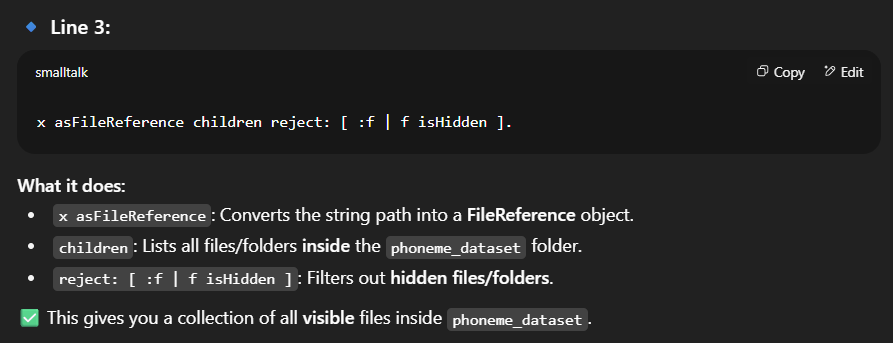


### why audio samples should be sorted ?

```smalltalk
x := FileLocator documents asAbsolute pathString , '\phoneme_dataset'. "'C:\Users\Neerja\Documents\phonemes_dataset'"

sampler := TpSampler new pathToFolder: x ; label: 'PAMSampler'.
sampler sampleNamesSorted.
```

- what does the code of sampleSirted give us ? : `files soerted alphabetically`
- why we need sorted files -> 
  - `phausto will mark each in synchronous order aɪ:1 ; b:2 .. so on`
  - hence, on picking phonemes audio --> it will map the IPAphoneme --> to its number --> get that numbered file form folder
  - eg : `HU` -> `u_colon` -> `12 file in folder`

```smalltalk
 "#(
  '''C:\Users\Neerja\Documents\phoneme_dataset\a_colon' '''C:\Users\Neerja\Documents\phoneme_dataset\aɪ' '''C:\Users\Neerja\Documents\phoneme_dataset\aʊ' '''C:\Users\Neerja\Documents\phoneme_dataset\b' '''C:\Users\Neerja\Documents\phoneme_dataset\d' '''C:\Users\Neerja\Documents\phoneme_dataset\dʒ' '''C:\Users\Neerja\Documents\phoneme_dataset\e' '''C:\Users\Neerja\Documents\phoneme_dataset\eə' '''C:\Users\Neerja\Documents\phoneme_dataset\eɪ' '''C:\Users\Neerja\Documents\phoneme_dataset\f' '''C:\Users\Neerja\Documents\phoneme_dataset\g' '''C:\Users\Neerja\Documents\phoneme_dataset\h' '''C:\Users\Neerja\Documents\phoneme_dataset\i' '''C:\Users\Neerja\Documents\phoneme_dataset\i_colon' '''C:\Users\Neerja\Documents\phoneme_dataset\j' '''C:\Users\Neerja\Documents\phoneme_dataset\k' '''C:\Users\Neerja\Documents\phoneme_dataset\l' '''C:\Users\Neerja\Documents\phoneme_dataset\m' '''C:\Users\Neerja\Documents\phoneme_dataset\n' '''C:\Users\Neerja\Documents\phoneme_dataset\p' '''C:\Users\Neerja\Documents\phoneme_dataset\r' '''C:\Users\Neerja\Documents\phoneme_dataset\s' '''C:\Users\Neerja\Documents\phoneme_dataset\t' '''C:\Users\Neerja\Documents\phoneme_dataset\u_colon' '''C:\Users\Neerja\Documents\phoneme_dataset\v' '''C:\Users\Neerja\Documents\phoneme_dataset\w' '''C:\Users\Neerja\Documents\phoneme_dataset\z' '''C:\Users\Neerja\Documents\phoneme_dataset\æ' '''C:\Users\Neerja\Documents\phoneme_dataset\ð' '''C:\Users\Neerja\Documents\phoneme_dataset\ŋ' '''C:\Users\Neerja\Documents\phoneme_dataset\ɒ' '''C:\Users\Neerja\Documents\phoneme_dataset\ɔ_colon' '''C:\Users\Neerja\Documents\phoneme_dataset\ɔɪ' '''C:\Users\Neerja\Documents\phoneme_dataset\ə' '''C:\Users\Neerja\Documents\phoneme_dataset\əʊ' '''C:\Users\Neerja\Documents\phoneme_dataset\ɜ_colon' '''C:\Users\Neerja\Documents\phoneme_dataset\ɪə' '''C:\Users\Neerja\Documents\phoneme_dataset\ʃ' '''C:\Users\Neerja\Documents\phoneme_dataset\ʈʃ' '''C:\Users\Neerja\Documents\phoneme_dataset\ʊ' '''C:\Users\Neerja\Documents\phoneme_dataset\ʊə' '''C:\Users\Neerja\Documents\phoneme_dataset\ʌ' '''C:\Users\Neerja\Documents\phoneme_dataset\ʒ' '''C:\Users\Neerja\Documents\phoneme_dataset\θ'
  )"
```

- what is the pattern of our files in folder ?


### why sortign is impt ?

- `phausto` understands numbers --> not strings
- so for our `TPSampler` aka `phausto` to make sound work --> we need to provide indexes of the` files / IPAPhoneme` we want to run

```smalltalk
| path pathSeparator x sampler musicString list dsp musicIPAString myString ipaList ipaListSorted|

"1. making the sampler"
x := FileLocator documents asAbsolute pathString , '\phoneme_dataset'.  "'C:\Users\Neerja\Documents\phoneme_dataset'"
sampler := TpSampler new pathToFolder: x ; label: 'PAMSampler'. "a TpSampler"

"wht is sorted list"
list := sampler sampleNamesSorted.
```

- 


```smalltalk
"does not retrun sorted list"
ipaList := (x asFileReference children collect: [ :f | f basenameWithoutExtension ]).

"returns sorted list"
ipaListSorted := ipaList asSortedCollection asArray.
```

- 

- testing : 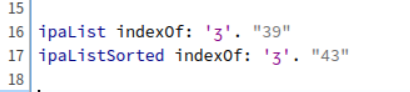

## 10th August'25

### HOw the whole things works 

- Give a folder -> make a TPSampler of it  -> make a DSP of it -> set the `Index` param ( the file index we want to run ) -. trig the `Gate` param to play the audio

- 
- 
- 

### where and how should we provide sorting ?

1. LIke the `ipaListSorted` --> always works : 
2. `TPSampler` --> `sampleNamesSorted` --> never  works : 

### What's the real issue with Domenico's code. 

```smalltalk
|  path pathSeparator x sampler musicString list dsp musicIPAString myString ipaList ipaListSorted|

"1. making the sampler"
x := FileLocator documents asAbsolute pathString , '\phoneme_dataset'.  "'C:\Users\Neerja\Documents\phoneme_dataset'"
sampler := TpSampler new pathToFolder: x ; label: 'PAMSampler'. "a TpSampler"

"wht is sorted list"
list := sampler sampleNamesSorted.

dsp := sampler stereo asDsp.
dsp init.
dsp start.

dsp setValue: 261 parameter: 'PAMSamplerNote'.

Reciter textToIPAPhonemes: 'book'. "#('b' 'ʊ' 'k')" "#('n' 'i_colon' 'r' '?' 'æ')"
myString := Reciter textToIPAPhonemes: 'book'.

"[myString do: [ : i |  dsp setValue: ( list  indexOf: i)  parameter: 'PAMSamplerIndex' . dsp trig: 'PAMSamplerGate'  . 0.2 seconds wait] ] fork.
"
"6. Play each phoneme and log index"
[
    myString do: [:i | 
        | idx |
        idx := list indexOf: i.
        Transcript
            show: 'Phoneme: ', i;
            show: ' | Index: ', idx printString;
            cr.
        dsp setValue: idx parameter: 'PAMSamplerIndex'.
        dsp trig: 'PAMSamplerGate'.
        (Delay forSeconds: 0.2) wait.
    ].
] fork.

Transcript open.
```

- as seen --> the index of phoneme is always `0` --> which in our case is `a_colon`
- ie. the `list := sampler sampleNamesSorted.` --> and in loop `idx := list indexOf: i.` --> aint working ( giving index correclty )

- 
- 


### the real issue 
- 

#### 3 different sortings 

1. 
```smalltalk
sampler := TpSampler new pathToFolder: x ; label: 'PAMSampler'.
sampler sampleNamesSorted.
```

- 

2. 

```smalltalk
ipaList := (x asFileReference children collect: [ :f | f basenameWithoutExtension ]).`
ipaListSorted := ipaList asSortedCollection asArray.`
```

- 

3. method 2 plus adding them to a new folder : prolly OS also sorts them here automatically

```smalltalk
ipaList := folder children collect: [ :f | f basenameWithoutExtension ].
ipaListSorted := ipaList asSortedCollection asArray.

"Create a temp folder with files in sorted order" 
sortedFolder := FileLocator documents / 'sorted_phoneme_dataset'. "{temp}\sorted_phoneme_dataset"
sortedFolder ensureCreateDirectory. "{documents}\sorted_phoneme_dataset"

"Copy files in sorted order to temp folder"
ipaListSorted do: [:name |
    | src dest |
    src := folder / (name , '.wav').
    dest := sortedFolder / (name , '.wav').
    src copyTo: dest.
].
```
- 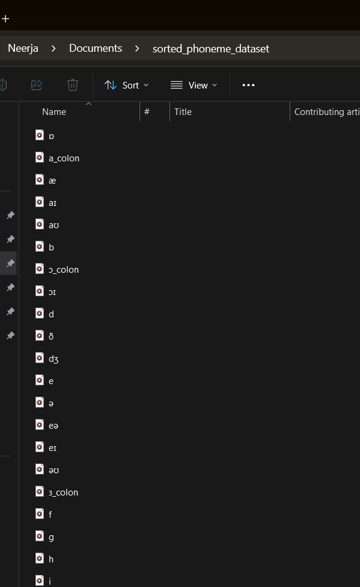
- 
- 

#### ALL THREE METHODS have different results DIFFERENTTTTTTTT !!!!! 😢

#### Soln 1. : sort using 2 --> find the indexes of phoneme  of our IPAString --> provide this list of index to DSP 
- issue --> we are still dependent on OS sorting method 
  - if for us index 4 == 'w.wav' --> for OS the same index can be 'p.wav' 😦
  - from where is OS sorting file coming in picture ?
    - 
    - Index == order of File structure 😠

```smalltalk
| folder ipaList ipaListSorted list dsp myString indexList |

"1. Get folder"
folder := FileLocator documents / 'phoneme_dataset'.

"2. Get sorted list of phoneme names (without extension)"
ipaList := folder children collect: [ :f | f basenameWithoutExtension ].
ipaListSorted := ipaList asSortedCollection asArray.

"Use ipaListSorted as our list"
list := ipaListSorted.

"3. Init DSP from the folder directly"
dsp := (TpSampler new
    pathToFolder: folder fullName;
    label: 'PAMSampler') stereo asDsp.

dsp init.
dsp start.
dsp setValue: 261 parameter: 'PAMSamplerNote'.
dsp traceAllParams.
	
"4. Convert the word to IPA phonemes"
myString := Reciter textToIPAPhonemes: 'book'.  "#('b' 'ʊ' 'k')"

"5. Find the index of each phoneme in the sorted list"
indexList := myString collect: [ :phoneme | list indexOf: phoneme ].

Transcript show: 'Indexes for "book": ', indexList printString; cr.

"6. Feed these indexes to DSP"
[
    indexList do: [:idx |
        Transcript show: 'Playing index ', idx printString; cr.
        dsp setValue: idx parameter: 'PAMSamplerIndex'.
        dsp trig: 'PAMSamplerGate'.
        (Delay forSeconds: 0.3) wait.
    ].
] fork.

```
#### Soln 2.

#### we need to rename these files as number_phoneme -->> to get correct index 💔

- the order in which we wanna name : 
- python script that does the job !!! : [Rename files as number_phonemeName.wav](<Code Try Ons/4_rename_phoneme_files/code.py>)

  - output of terminal :
    - 
  - Output of the file structure nowwwww !!!!! : 
    - 
  - yipeeeee 😎

### some other rookie mistakjes in SAM phoenem to IPA phoneme converter : 

#### remove `?` from logic of SAM phoenem to IPA phoneme converter 
- 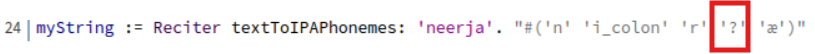
- when we remove stress marker -> we also need to remove `\` from the string --> as they can result in `?` in IPA Phoneem string.
- 

- code : 
- works now : 

#### adding more rules and a '' empty rule in IPA converter. --> to makr the dictionary comprehensive

- hence no more `?` in IPA string
  - 

#### added better loggers tooo !!

- 

### on to the actual code !!

- cant use below .. as now we are printing `000_phoneme`
  - 

- hence, need to define a dictionary !!
  - 

```smalltalk
"the code i want to use"
| path sampler dsp ipaOrder word myString targetIndex phoneme |

"1. Path to your already-sorted folder"
path := FileLocator documents / 'phoneme_dataset_sorted'.

"2. Create sampler from sorted folder"
sampler := TpSampler new
    pathToFolder: path fullName;
    label: 'PAMSampler'.

"3. Define your custom IPA order (matches file order in phoneme_dataset_sorted)"
ipaOrder := #('a_colon' 'aɪ' 'aʊ' 'b' 'd' 'dʒ' 'e' 'eə' 'eɪ' 'f' 'g' 'h' 'i' 'i_colon' 'j' 'k' 'l' 'm' 'n' 'p' 'r' 's' 't' 'u_colon' 'v' 'w' 'z' 'æ' 'ð' 'ŋ' 'ɒ' 'ɔ_colon' 'ɔɪ' 'ə' 'əʊ' 'ɜ_colon' 'ɪə' 'ʃ' 'ʈʃ' 'ʊ' 'ʊə' 'ʌ' 'ʒ' 'θ').

"4. Initialize DSP"
dsp := sampler stereo asDsp.
dsp init.
dsp start.

"Set audible note & level"
dsp setValue: 261 parameter: 'PAMSamplerNote'.   "Middle C"
"dsp setValue: 0.9 parameter: 'PAMSamplerUlevel'. ""Loud enough"""

"5. The word we want to play"
word := 'cat'.
myString := Reciter textToIPAPhonemes: word.

Transcript show: 'Phonemes for "', word, '": ', myString printString; cr.

"6. Play each phoneme in sequence"
[
    myString do: [:phoneme |
        targetIndex := ipaOrder indexOf: phoneme.
        Transcript show: 'Playing ', phoneme, ' (index ', targetIndex printString, ')'; cr.
        dsp setValue: targetIndex - 1 parameter: 'PAMSamplerIndex'.  "0-based index"
        dsp trig: 'PAMSamplerGate' for: 0.05.
        0.25 seconds wait
    ].
] fork.

Transcript open.
```

### refactoring the PAMDSP code completley !!

#### info that might come handy!
- where should cleanup happen --> in main class / utility class
  - 
- when to stop + destroy dsp in asynchrouns calls
  - 
  - hence, `cleanup` inside a fork --> so `it destroys that threads dsp !!`
    - 

### Final looks of code now ❤️

```smalltalk
| pamDsp dsp|

pamDsp := PAMDsp new. "a PAMDsp"  "This initializes DSP and starts it"
pamDsp sayNumbers0to9 .
pamDsp sayNumbers: #(8 3 5 7).

```
- `AUDIO TIMEEEEE !!!`
  - [▶ Watch demo](Readme/readme-images-vc/20250811-1832-45.6292329.mp4)
  - <video controls src="Readme/readme-images-vc/20250811-1832-45.6292329.mp4" title="Title">0to9</video>
  - [▶ Watch demo](Readme/readme-images-vc/20250811-1834-21.5947342.mp4)
  - <video controls src="Readme/readme-images-vc/20250811-1834-21.5947342.mp4" title="Title">#(8 3 5 7)</video>
  - Transcripts :
    - 

## 11th August'25

### some rookie code mistakes + optimization

1. Finding better ways to have specific file paths 
```smalltalk
    "Get the documents folder and append subfolder in a cross-platform way"
    folderPath := FileLocator documents / aFolderName.
```
- 

2. why the below error ? --> cos of string concatation

```smalltalk
 path := FileLocator documents , pathSeparator , 'numbers'. "File @ C:\Users\Neerja\Documents.\.numbers"
```

- 
- reolved image :
  - 

3. are we handling indexes correctly via this line ? 

```smalltalk
ipaText do: [:token |
            idx := sortedIPAarray indexOf: token ifAbsent: [ 0 ].
				PAMDspUtility log: 'Sorted IPA Array index for ', token printString, ' is ', idx printString.

            idx > 0 ifTrue: [
                dsp setValue: idx-1 parameter: 'PhonemeIndex'.
                PAMDspUtility log: ('Playing phoneme ' , token , ' at index ' , idx printString).
                dsp trig: 'PhonemeGate' for: 0.05.
                (Delay forSeconds: 1) wait.
            ] ifFalse: [
                PAMDspUtility log: ('Skipping unknown phoneme token: "' , token , '"').
            ].
        ].
```
- 

### `Final SHOWDOWNNNNNNNN`

```smalltalk
| pamDsp |

pamDsp := PAMDsp new. 
pamDsp sayPhoneme: 'dog' . 
```
- `VIDEOOOO TIMEEE`

  - [▶ Watch demo](Readme/readme-images-vc/20250811-1859-11.3013338.mp4)
  - <video controls src="Readme/readme-images-vc/20250811-1859-11.3013338.mp4" title="Title">DOG</video>
  - transcript : 
    - 

  - NOTE : we later renamed method to `pamDsp sayText: 'dog'.`


### questions for Domenico

- how to set value of Ulevel.
- is there a way i can get the values for of Ulevel, Gate, Index, Note ... for lets say logging
- how to make this better ? --> is it parser ? giving us amplitude + pitch at which we speak 

## 12th August'25

### why we cannot hear some audio files in DSP --> but can hear some

- in `PAMDsp` we have been loading the stereo file only 
- apparently they were all mono

- code to find mono or stero : [Identify Code](<Code Try Ons/5_Mono_to_stereo/identify_mono_or_stereo.py>)

- code to convert mono to stereo : [Convert Code](<Code Try Ons/5_Mono_to_stereo/converter.py>)
  - terminal output : 

- another way to find : `RIGHT CLICK ON AUDIO FILE` -> `PROPERTIES` -> `CHANNEL`
  - 

### code to convert mono to stereo : 

- need to install `ffmeg`
  - installaiton link : [installation link](https://ffmpeg.org/download.html)
  - YT link to install : [yt](https://www.youtube.com/watch?v=JR36oH35Fgg)
  - installed succesfully : 

- runnign the convert code : 
- identify code after convert code : 
  - 
  - `ITS STEREO NOWWW !! `:
    -  

### understanding the presets 

```smalltalk
"value to tweak ~~"

"amplitude ...aka Volume"
dsp setValue: 0.2 parameter: 'PAMSamplerULevel'. "Loud enough"

"pitch ... aka sharpness of voice"
dsp setValue: 500 parameter: 'PAMSamplerNote'.   "Middle C"

"streching the note"
dsp trig: 'PAMSamplerGate' for: 2.

"wait time to play next phoneme"
0.5 seconds wait
```

### understanding params 

1. `PAMSamplerNote` : RANGE : [ 200 to 900 ]

|Value | Inference | Notes |
|--|--|--|
| 200 | Manly | very base in voice |
| 500 | Kid Voice  | somewhere in middle --> you'll find the female voice |
| 900 | High Pitch | sounds alien 😆 |

#### audio smaples : `playing with frequency .. aka pitch`

- [▶ Watch demo](Readme/readme-images-vc/20250812-1917-42.4462476.mp4)
- <video controls src="Readme/readme-images-vc/20250812-1917-42.4462476.mp4" title="Title"></video>

2. `PAMSamplerULevel` : RANGE : [ 0 to 1 ]

|Value | Inference | Notes |
|--|--|--|
| 0 | Mute | silence |
| 1 | Loud | max it can give |

#### audio smaples : `playing with amplitude .. aka volume`

- [▶ Watch demo](Readme/readme-images-vc/20250812-1919-57.5616726.mp4)
- <video controls src="Readme/readme-images-vc/20250812-1919-57.5616726.mp4" title="Title"></video>

3. `streching a note`
- think of it as hitting a piano key .. and pressing on it
  - if value is 2 , 3.. it eventually fades off
  - if value is 0.1 .. no streching ... best gliding seen between notes !

#### audio smaples : `playing with note streching`

- [▶ Watch demo](Readme/readme-images-vc/20250812-1922-02.9389929.mp4)
- <video controls src="Readme/readme-images-vc/20250812-1922-02.9389929.mp4" title="Title"></video>

|Value | Inference |
|--|--|
| 0.1 | the note is not streched --> hence we can see gliding of one phoneme to next --> best !!❤️ |
| as u increase .. lets say 2, 3 | stops seen in one phoneme's transition and next phoneme's pickup  |

4. `wait time to play next phoneme`
- ig 0.4 is good 

### gender based data 

|Gender | Inference |
|--|--|
| Male | low note , high Ulevel |
| Female | high note , low Ulevel |

### age based voice

|Age | Inference |
|--|--|
| adult | 275 as Note |
| Child | 500 as Note |

#### understanding the time given in the above code snippet
- 
- how can we strech note ?
  - 

#### so when we are making our stress + length in parser -- what we mean to apply is : 

- `stress` == volumen added to that phoenme .. ie`Ulevel` ( we can also think of lowering the pitch `Note` )
- `Length` == strech of the phoneme .. ie in line `dsp trig: 'PAMSamplerGate' for: 0.1.`

```smalltalk
"the code i want to use"
| path sampler dsp ipaOrder word myString targetIndex phoneme |

"1. Path to your already-sorted folder"
path := FileLocator documents / 'phoneme'.

"2. Create sampler from sorted folder"
sampler := TpSampler new
    pathToFolder: path fullName;
    label: 'PAMSampler'.

"3. Define your custom IPA order (matches file order in phoneme_dataset_sorted)"
ipaOrder := #('a_colon' 'aɪ' 'aʊ' 'b' 'd' 'dʒ' 'e' 'eə' 'eɪ' 'f' 'g' 'h' 'i' 'i_colon' 'j' 'k' 'l' 'm' 'n' 'p' 'r' 's' 't' 'u_colon' 'v' 'w' 'z' 'æ' 'ð' 'ŋ' 'ɒ' 'ɔ_colon' 'ɔɪ' 'ə' 'əʊ' 'ɜ_colon' 'ɪə' 'ʃ' 'ʈʃ' 'ʊ' 'ʊə' 'ʌ' 'ʒ' 'θ').

"4. Initialize DSP"
dsp := sampler stereo asDsp.
dsp init.
dsp start.
dsp displayUI.
dsp traceAllParams.

"Set audible note & level"
dsp setValue: 1 parameter: 'PAMSamplerULevel'. "Loud enough"
dsp setValue: 500 parameter: 'PAMSamplerNote'.   "Middle C"

"5. The word we want to play"
word := 'dog'.
myString := Reciter textToIPAPhonemes: word.

Transcript show: 'Phonemes for "', word, '": ', myString printString; cr.

"6. Play each phoneme in sequence"
[
    myString do: [:phoneme |
        targetIndex := ipaOrder indexOf: phoneme.
        Transcript show: 'Playing ', phoneme, ' (index ', targetIndex printString, ')'; cr.
        dsp setValue: targetIndex - 1 parameter: 'PAMSamplerIndex'.  "0-based index"
        dsp trig: 'PAMSamplerGate' for: 0.1.
        0.4 seconds wait
    ].
] fork.

Transcript open.
```

- words having g , s , d , u_colon --> are pronoced well [ dog , cap ]

### am out till 18th --> see ya then ❤️

## 18th August'25

### finding amplitude and length from stress

- stress value ranges from [ 1 to 5] .. if its 0 --> we are considerign it default 1
- hence `5 === max amplitude` , `1 === min amplitude`
- in pharo ... i dont want to play it below .5 ... so in pharo sam 
  - conversion logic :
  - stress of [1 to 5 ] === sam amplitude [ 0.5 to 1]
  - formula :
    - 


### `our limits`

| pharo stress range in rules | length range for us ( duration ) | amplitude range for us |
|--|--|--|
| [4 to 6] | [ 0.1 : fast , not streched to 0.4 : slow,  streched  ] | [ 0.5 : low to 1 : high]|

### `our formulas !!`

- amplitude :
  - 

- duration :
  - 

- output :
  - 

### `FINALLLLL SHOWWW FOR PROSODDDYYYYYY !!!!!` ❤️

```smalltalk
|dsp|

dsp := PAMDsp new.

"dsp sayText: 'dog'."

dsp sayTextWithProsody: 'dog'.
```

- [▶ Watch demo](Readme/readme-images-vc/20250818-1756-05.7129125.mp4)
- <video controls src="Readme/readme-images-vc/20250818-1756-05.7129125.mp4" title="Title"></video>
- commit : 
- Trascript : 😇
  - 
  - `yellow box :[  ipa_phoneem , stress value ]`
  - `green box : [ amplitude , stress , duration parameters ]`

### doing age based initlizataion !!!

#### `FINALLLLL PROSODYYYYYY SHOW BASED ON AGEEEE !!!!!!` 😗

```smalltalk
|dsp|

dsp := PAMDsp new.

"dsp sayText: 'dog'."

"toggle true / false below"
dsp sayTextWithProsody: 'dog' asChild: false.
```
- [▶ Watch demo](Readme/readme-images-vc/20250818-1905-52.5344590.mp4)
- <video controls src="Readme/readme-images-vc/20250818-1905-52.5344590.mp4" title="Title"></video>
- how we did it ?
  - pass as a flag in function :
    - 
  
  - the helper utility used above: 
    - 

  - in `PAMDSPUtility` we defined instanceVariables : 
    - 

    - and respective getter-setter
      - 
      - similar with `adultPreset`

    - `so the note value returns from PAMDSPUtility and is set as our Ulevel in our PAMDSP !!!!` 😍 

    - Transcript :
      - 

#### shagun ke 101 commitssss !!!!! -- happpyyyy dayyyyy 😂
- 

## 23rd August'25

- quick meet with Domenico
### expectationos in last week of GSoC ie. 25th to 31st Aug

- need to put the folder of [ phoneme + number ] in GitHub 
- write a little readme 
  - history of PAM 
  - link SAM javascript .. inspired by this 
  - made via phausto,  using this samples ---> phoneme + numbers 
  - examples code snippets 

- ToDo : 
  - code changes 
    - long method warning in code --> make short methods
    - put comments in class
    - use streams instead of strings : refer pharo books

### things to write in Submission :

- in future dev of project : we can have formant synthesis based TTS

### issues resolved 

#### pragma

- for pragma .. think we are writing in a playground but without self
- the escape character for string ie. `''` is `''`
- hence write the praga defnition as :
```smalltalk
<script: 'self sayTextWithProsody: ''dog'' asChild: false'> : escape charater
```

- 

#### baseline

- each package we are adding ie [Coypu, CoypuIDE, Phasuto] is calling different version of Toplo
- just add dependency of `CoypuIDE` 
  - Phasto need CoypuIDE
  - we need Phausto
  - `so we add only phausto`

- 

- chekc wiki of phausto : 
- 

#### resolving baseline issue post meet

- adding just CoypuIDE in baseline stil failed 😢


- changed our metacello script to :
```smalltalk
Metacello new
	baseline: 'PAM';
  repository: 'github://neerja-1984/PAM-GSoC-25-Project:master/src';
  onConflict: [ :ex | ex useIncoming ];
 	onUpgrade: [ :ex | ex useIncoming ];
  load.
```

- use the incoming version when conflict arises, then upgarde to in !!!


#### It worked in a new imageeee + all tests are greenn !!!! 💚💚💚💚💚💚💚

- [▶ Watch demo](Readme/readme-images-vc/20250823-1519-08.0158074.mp4)
- <video controls src="Readme/readme-images-vc/20250823-1519-08.0158074.mp4" title="Title"></video>
- 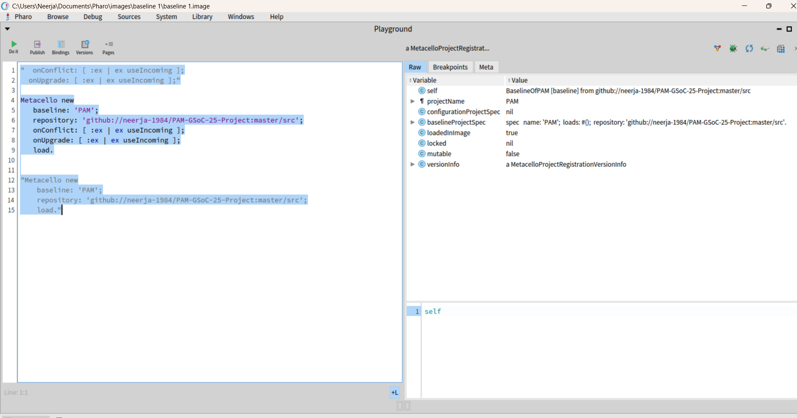

## 24th August'25

### Blog timeeeee !!

- ideas as of now in my mind`
1. in PAM code project
  - add some code snippets + basic info + add zips of audio folder to it 
  - make a wiki for it for metacello installation

2. make another repo : Relive Gsoc'25 with me 
  - add readme of weekly updates
  - make a github.io ( website of it ) --> add gsoc submission related data + blog links 
  - see past submissions of previous gsoc students 

refernce :
- https://github.com/valens200/GSoC-2024
- https://tyler-li-mcgill.tech/blog/gsoc3

## 26th August'25

### Gthub Hosted page !!! 😊

- [Click Here to watch it live !!](https://neerja-1984.github.io/rewind-gsoc25/)
- [Github Repo](https://github.com/neerja-1984/rewind-gsoc25)

### uploaded this awesomeeee readme to Github with images and videos
- PS. Videos dont load -> coz of high memory ( viewer will have to download it to view from Github ) 💔

## want to make a lovely PDF of this lovely readme i prepared in the last few months!! ❤️😭

- `vscode extension -> Markdown PDF (https://marketplace.visualstudio.com/items?itemName=yzane.markdown-pdf)`
- `right click readme -> export to pdf`
- `creates a readme.pdf next to readme.md in folder structure` 😄